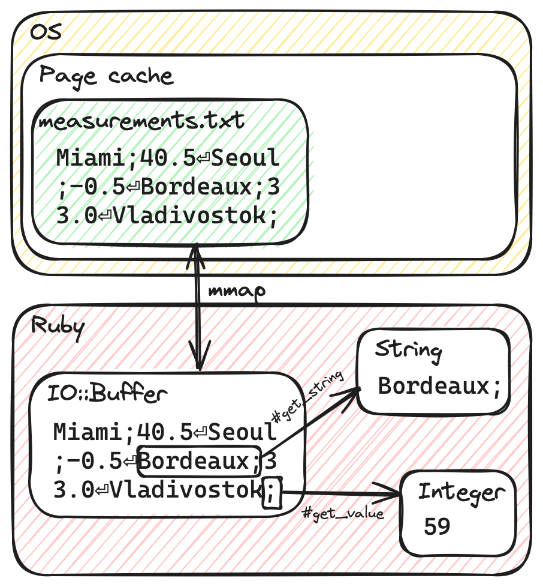

<style>
    img[alt~="center"] {
        display: block;
        margin: 0 auto;
    }
</style>

<script src="asciinema-player.js"></script>
<link rel="stylesheet" href="asciinema-player.css" />
<script src="asciinema-loader.js"></script>

# One Billion Rows in Ruby

### Rian McGuire

Melbourne Ruby - March 2024

---

# 1BRC

<!-- 
Back in January, I saw this Java coding challange posted on Hacker News.

(read quote)
-->

https://github.com/gunnarmorling/1brc

> The One Billion Row Challenge (1BRC) is a fun exploration of how far modern Java can be pushed for aggregating one billion rows from a text file.

---

Aggregate the input:
```
Hamburg;12.0
Bulawayo;8.9
Palembang;38.8
St. John's;15.2
Cracow;12.6
Bridgetown;26.9
Istanbul;6.2
Roseau;34.4
Conakry;31.2
Istanbul;23.0
...
```

into `min/mean/max`, sorted by name:

```
{Abha=-23.0/18.0/59.2, Abidjan=-16.2/26.0/67.3, ...}
```

<!--
The task is to take a 1 billion row input file of weather station temperature measurements, and aggregate them into minimum, mean and maximum by station.

You're not allowed to use any external dependencies.

I thought it would be fun to try doing this in Ruby instead of Java, and see how far we can push Ruby.

This talk is about my adventure trying to optimise Ruby code for this problem, and some tool and techiniques I used along the way.
-->

---

# How big are one billion rows?

```
$ ./create_measurements.sh 1000000000
$ du -h measurements.txt
13G     measurements.txt
```

- It can fit in RAM on a single machine (my machine has 32GB)
- The OS will be able to cache the entire file in RAM
- We're going to be CPU-bound, not IO-bound

<!--
What sort of sizes are we talking about here in terms of bytes?

The "create measurements" script is from the original 1brc repo, and it generates an input file with the specified number of lines.

So we run that with 1 billion, and we get a 13 gigabyte input file.

That's big enough that we should be careful how we work with it - we probably want to stream it line-by-line, rather than loading the whole file into RAM before we do anything.

But it's not "big data" - it's easily small enough for a single machine to handle entirely in RAM.

Importantly, it's small enough that the OS will cache the entire file in RAM after it's been loaded for the first time, so the performance is really a question of how quickly we can process those bytes on the CPU, not how quickly we can load from disk.
-->

---

# Baseline

<!-- I started with a basic Ruby implementation. -->

<!-- open 001_baseline.rb, talk it through -->

---

# Measurement

- Tools
    - time - shell built-in
    - hyperfine - https://github.com/sharkdp/hyperfine
    - `require 'benchmark'`
- Noise and statistical significance
    - Did the change actually improve anything?

<!--
So we have a Ruby program - how do we measure how fast it is?

The simplest tool is one you already have - it's built into your shell. You can prepend `time` to any command.

Demo:
time ./001_baseline.rb measurements_1M.txt

I'm running this with an input file with only 1 million lines for the sake of time.

If I run it multiple times, you'll see that the time is different on each run - there's some noise in the measurements.

That can be a bit of a trap when you're trying to determine if a change you just made improved the performance - it's quite easy to trick yourself into thinking something has worked. Ideally you want to do multiple runs and average them.

There's tool I found called hyperfine that automates this, and it can also compare different commands and tell you the relative performance difference. I'll give a demo of that soon.
-->

---

# Baseline

<div class="asciinema" data-url="baseline.cast"></div>

---

# Baseline


<!--
I ran this implementation with the 10 million line file and multiplied the result by 100.

1099 seconds - that's about 18 minutes!

For comparison, I also benchmarked two different Java implementations - they're in the 1BRC repo if you want to check them out.

The 45s one looked like a "middle-of-the-road" Java implementation. I'm not super familiar with Java, but it seemed like an idomatic Java implementation without any crazy optimisation tricks, other than working on chunks of the input in parallel.

And the second one was close to the top of the leaderboard.

There's a lot of work to do if we're going to beat Java.
-->

----

# YJIT

`RubyVM::YJIT.enable`

<!--
Let's get the easy stuff out of the way first.

Will YJIT save us all from ever having to think about Ruby performance?

I'm using Ruby 3.3.0, which allows you to enable YJIT without using the command-line option or environment variable.
-->

----

# YJIT

<div class="asciinema" data-url="yjit.cast"></div>

----

# YJIT

17% improvement!


<!--
...for just enabling a flag. That's pretty cool - I'm very excited about Ruby's future with YJIT.

So we've got our basic implementation, we got a boost by enabling YJIT, now what?

How do we decide what to work on next? We could stumble around just changing things and see if they help, but it would be much better if we knew what the slowest parts were.

Enter:
-->

---

# Profiling

- Tracing
    - ruby-prof - https://ruby-prof.github.io/
- Sampling
    - Stackprof - https://github.com/tmm1/stackprof
    - rbspy - https://rbspy.github.io/

<!-- For Ruby, there are two broad classes of profiling tool -->

<!--
Tracing tools like ruby-prof hook into Ruby's tracepoint API, which fires an event on every line that executes. This is high overhead - ruby-prof documentation says it typically makes programs run about 2x slower.

Sampling tools work by periodically (say 100 times a second) observing the current callstack of the process and recording what methods are currently executing.

Sampling gives a good picture of what the program is spending time doing. However it can't tell you things like exactly how many times a method was called, or diffentiate between between a slow function and a frequently called function.
-->

<!--
stackprof:
* records GC time
* can profile blocks of code, rather than the entire process

rbspy:
* has option to automatically record subprocesses
* works on any Ruby process, without installing a gem
-->
---

# Running Stackprof on a program

```
stackprof run --out stackprof.dump --raw -- ./002_yjit.rb measurements_10M.txt
stackprof --text stackprof.dump
stackprof --d3-flamegraph stackprof.dump > flamegraph.html
```

<div style="overflow: hidden; flex: 2; border: 1px solid grey;">
    <iframe src="flamegraph.html" style="width: 100%; height: 700px; border: 0;"></iframe>
</div>

<!--
* The slowest method we're using is String#split (37% of time)
* We're spending 11% of time in GC

Let's see what we can do about both of those. I'm going start by looking at the garbage.
-->
---

# Garbage collection refresher

- Unused objects aren't cleaned up immediately
- Periodically, Ruby searches for objects that are no longer needed and releases them
- Immediate ("copy-by-value") objects don't require GC
    - Integer, Float, Symbol, true, false, nil

<!--
A quick refresher on garbage collection

(talk through slide)
-->

---

# Counting allocations

`GC.stat(:total_allocated_objects)`

```ruby
f.each_line do |line|
    name, value = line.split(";") # <- what are the allocations on this line?
    stations[name].add(value.to_f)
end
```

<!--

You can use GC stat total allocated objects to get the total number of objects that have been allocated so far, and you can compare it before and after to measure a particular block of code.

I measure this line, and there are 4 allocations. Anyone got any guesses what they might be?

array, 2x string, unfrozen string literal

(open 003_gc_golf.rb)

This is my attempt at trying to minimise the number of allocations per input line.

Reduced the number of allocations to 1 (excluding the line String itself)
-->
---

# Garbage is expensive

Reducing the number of allocations (and avoiding `String#split`) improved time by 29%


---

# Going parallel

My CPU has 6 cores (12 threads), but we're only using one!

- Threads
    - Global VM Lock (GVL) means threads won't help on this CPU-bound problem
- Processes (fork)
    - Uses more memory
    - Communication between processes is more expensive
- Ractors
    - Theoretically, this is what Ractors are good at
    - Each Ractor can execute Ruby code in parallel
    - Experimental

<!-- We should be able to get at least a 6x performance gain -->

<!-- What are options for parallel execution in Ruby? -->

<!-- Because we're spending approximately all of our time executing Ruby code and not waiting on IO, only a single thread will be able to execute at any time -->

---

# Going parallel

Divide the work
- By line
    - Simple, but high coordination overhead
- By range of lines
    - The lines are different lengths, so we can't seek to the byte offset of a specific line
- By range of bytes
    - We could end up starting in the middle of a line


<!--

We need a strategy for dividing the work, and we need to be able to merge it back together.

For dividing the work, there a few options, each with different challanges.

(read through slide)

-->

---

# Going parallel

Divide the work
- By line
    - Simple, but high coordination overhead
- By range of lines
    - The lines are different lengths, so we can't seek to the byte offset of a specific line
- By range of bytes
    - We could end up starting in the middle of a line


---

# Going parallel

Divide the work
- By line
    - Simple, but high coordination overhead
- By range of lines
    - The lines are different lengths, so we can't seek to the byte offset of a specific line
- By range of bytes
    - We could end up starting in the middle of a line


---

# Going parallel - Processes

<!--
(open up 005_parallel_processes.rb)

I'm using the parallel gem here for the sake of readability, but internally that's calling Process.fork and using IO.pipe and Marshal to communicate with the child processes.
-->

---

# Going parallel - Processes

- 6.7x improvement over non-parallel


<!--
Ruby is a bit over twice as slow as the middle-of-the-road Java implementation. That's honestly better than I was expecting - this sort of CPU-intensive work isn't not something Ruby is great at.

So what about Ractors - they should be even faster because everything happens within the one Ruby process.
-->

---

# Going parallel - Ractors

- Only a 1.7x improvement over non-parallel 👎
- Wild guess: GC is still single-threaded? Everything gets blocked waiting on GC?


---

# Can we go further?

<div class="asciinema" data-url="rbspy-004.cast"></div>

<!--
Let's run the profiler again and see what the bottleneck is now.

I've switched to using rbspy this time, because it has better support for recording multiple subprocesses.

The slowest thing is now each_line, but what can we do instead?
-->

---

# strace

- Understanding how a process is interacting with the system
- Similar tool on macOS: dtrace
- `strace ./003_gc_golf.rb measurements_1M.txt`

```
...
read(5, "a;17.5\nDili;17.5\nOuagadougou;16."..., 8192) = 8192
read(5, ".4\nRangpur;9.3\nKinshasa;39.8\nTeh"..., 8192) = 8192
clock_gettime(CLOCK_PROCESS_CPUTIME_ID, {tv_sec=0, tv_nsec=779449478}) = 0
clock_gettime(CLOCK_PROCESS_CPUTIME_ID, {tv_sec=0, tv_nsec=779505049}) = 0
read(5, "Memphis;12.7\nTokyo;18.5\nBaghdad;"..., 8192) = 8192
read(5, "n;7.8\nGaroua;25.1\nDili;34.1\nMeda"..., 8192) = 8192
read(5, "27.3\nMelbourne;10.8\nBlantyre;27."..., 8192) = 8192
read(5, "bouti;24.5\nTripoli;23.1\nKyoto;-5"..., 8192) = 8192
read(5, "10.9\nAmsterdam;26.0\nOslo;8.9\nSar"..., 8192) = 8192
read(5, "i;10.6\nLake Havasu City;24.3\nPor"..., 8192) = 8192
...
```

---

# Copying is expensive

How does `#each_line` get the next line from a file?
1. Ruby makes `read(file, &buffer, 8192)` syscall
2. OS copies 8192 bytes from the file (already cached in RAM) into an internal Ruby buffer
3. Ruby finds the index of the next `\n` in the buffer
4. Ruby copies the line bytes from buffer into a new String object


---

# IO::Buffer

- (Experimental) low-level memory API
- https://docs.ruby-lang.org/en/master/IO/Buffer.html
- Use `IO::Buffer#map` to memory-map (mmap) a file
- This tells the OS to use virtual memory to make the file appear within Ruby's memory, without copying



<!--
There's an alternative operating system API for accessing files called mmap.

This removes the overhead of calling read for every 8 KiB, and we don't have to allocate a String object for every line.

It's not magic - you're swapping syscalls to `read` with page faults, but in this case the file is already in the OS cache

(open io buffer rb)
(explain IO::Buffer API)
-->
---

# IO::Buffer

Slower 😢. We no longer have `each_line` overhead, but we've traded it for lots of calls to `buffer#get_value`


---

# Cheating? — IO::Buffer + C extension

`IO::Buffer#get_string_until(offset, SEMI)` feels like an API that could reasonably exist in the standard library

<!--
So I wrote a tiny C extension that adds it.
-->


<!--
The Java 1BRC competition rules say you're not allowed to use external libraries. But whatever - those rules aren't real - we can go wherever we want on this Ruby adventure.
-->

---

# Cheating? — IO::Buffer + C extension

42% faster than `File#each_line`


---

# What's next?

```
% self  % total  name
 33.04    33.04  get_string_until [c function] - (unknown)
 22.11    85.40  block in process_chunk - ./007_io_buffer_ext.rb:57
 19.35    19.35  to_f [c function] - (unknown)
  7.72     7.72  getbyte [c function] - (unknown)
  6.99    10.83  add - ./007_io_buffer_ext.rb:24
  4.83    98.39  loop - <internal:kernel>:192
  1.55     1.55  + [c function] - (unknown)
  1.34     1.34  < [c function] - (unknown)
  0.96     0.96  > [c function] - (unknown)
  0.40     0.40  value [c function] - (unknown)
  0.30     8.10  load - <internal:marshal>:35
  0.27     0.27  (unknown) [c function] - (unknown)
  0.21    90.89  fork [c function] - (unknown)
  0.18     0.35  dump [c function] - (unknown)
  0.18     0.18  write [c function] - (unknown)
  0.10     0.10  wait [c function] - (unknown)
  0.08     0.08  read [c function] - (unknown)
  0.08     0.08  eof? [c function] - (unknown)
  0.05     0.08  require_relative [c function] - (unknown)
  0.05     0.06  new [c function] - (unknown)
```

---

# Custom decimal parser

- `String#to_f` is 19% of time
- We're allocating a String for every row in order to parse it into a Float

<!--
The decimals always have a single fractional digit - we don't even need floats - we can use integers storing tenths of a degree.
-->

---

# Custom decimal parser

```ruby
EOL = "\n".ord  # 10
POINT = ".".ord # 46
ZERO = "0".ord  # 48
# "1".ord == 49
# "2".ord == 50
# "3".ord == 51
# "4".ord == 52

# "42.3\n" -> 423
value = 0
while (b = buffer.get_value(:U8, offset)) != EOL
    if b != POINT
        value *= 10
        value += b - ZERO
    end
    offset += 1
end
```

---

# Custom decimal parser

Faster...just


<!--
Pretty amazing that writing this in Ruby is faster.

I'm not sure if it's saying something good about YJIT, or something bad about the String#to_f implementation.
-->

---

# What's next?

```
% self  % total  name
 33.78    84.73  block in process_chunk - ./008_custom_parser.rb:79
 25.36    25.36  get_value [c function] - (unknown)
 18.17    18.17  get_string_until [c function] - (unknown)
  8.00     8.00  getbyte [c function] - (unknown)
  5.49     5.49  add - ./008_custom_parser.rb:27
  5.37    98.35  loop - <internal:kernel>:192
  1.83     1.83  * [c function] - (unknown)
  0.76     0.76  (unknown) [c function] - (unknown)
  0.18     0.18  eof? [c function] - (unknown)
  0.16    90.59  fork [c function] - (unknown)
  0.16     0.16  wait [c function] - (unknown)
  0.14     0.14  value [c function] - (unknown)
  0.12     0.18  dump [c function] - (unknown)
  0.11     8.16  load - <internal:marshal>:35
  0.05     0.11  new [c function] - (unknown)
  0.05     0.05  write [c function] - (unknown)
  0.05     0.05  read [c function] - (unknown)
```

<!--
We're now spending 34% of self time in the loop - there's lots of Ruby code for manging the current offset, and we're back to doing #get_value calls.
-->

---

# Cheating - Even more C extension

- Create a new `IO::Buffer::Reader` class that tracks the current offset in C
- Implement the decimal-to-int parser in C

<!--
(open 009_io_buffer_reader.rb)
(quickly open C extension)

Is this getting too close to just writing the whole thing in a C extension?
-->

---

# Cheating - Even more C extension


---

# Cheating — polars-df gem

<!-- Can we just `gem install` a highly-optimised solution to this exact problem? Yes, yes we can. -->

- https://pola.rs/
- Similar to the pandas data analysis library for Python
- Ruby isn't an officially supported language, but there's a gem: https://github.com/ankane/polars-ruby

<!-- open 010_polars.rb -->

---

# Cheating — polars-df gem


<!-- This is the pragmatic "software engineering" solution -->

---

# How is the Java implementation still faster?

- Completely eliminating new allocations/GC in the hot loop, using a custom hash table
- Using bit pattern tricks to search/parse multiple bytes at once
- There's an interesting blog post by one of the top 10:
  https://questdb.io/blog/billion-row-challenge-step-by-step/

```java
private static final long BROADCAST_SEMICOLON = 0x3B3B3B3B3B3B3B3BL;
private static final long BROADCAST_0x01 = 0x0101010101010101L;
private static final long BROADCAST_0x80 = 0x8080808080808080L;

private static long semicolonMatchBits(long word) {
    long diff = word ^ BROADCAST_SEMICOLON;
    return (diff - BROADCAST_0x01) & (~diff & BROADCAST_0x80);
}

private static int nameLen(long separator) {
    return (Long.numberOfTrailingZeros(separator) >>> 3) + 1;
}
```

<!--
What we have with the IO::Buffer::Reader implementation feels pretty minimal.

We're working byte-by-byte - the hyper optimized implementations are doing bit pattern tricks to search multiple bytes in one operation.

There's an interesting blog post that goes into the detail about how that works.
-->

---

# On your machine vs production

- Different computers have different performance characteristics
- Make sure your optimise for the right thing

<!--
One last interesting thing.

It's important to keep in mind that different computers have different performance characteristics. An optimisation that's faster on your development machine might be slower in production.

Even in production, machines from different generations will behave differently.

I'm not saying don't do any optimisation work locally, but it's something you should conscious of.
-->
---

# On your machine vs production

- AMD Ryzen 5 2600 desktop (mid-range 2018 CPU, 6 cores)
- M2 MacBook Air (2022, 8 cores: 4 performance, 4 efficiency)


<!--
Here's an interesting example that kind of illustrates this.

I've been taking on these measurements on a desktop at home. If I compare how it performs to this laptop, you can see that initially the laptop is about 20% faster, but if I keep continously running the benchmark, it gets slower and slower.

Any ideas why?

-->

---

# Conclusion

- The optimisation loop
    - Measure the baseline
    - Profile and identify possible areas for improvement
    - Compare your change with the baseline
* Readability/maintainability vs performance trade-off
    - Breaking abstractions
    - Hard-coding assumptions
* Life is about the journey
* Can you make it go faster?
    - All the code is available at: https://github.com/rianmcguire/1brc-ruby

---

# Questions?
